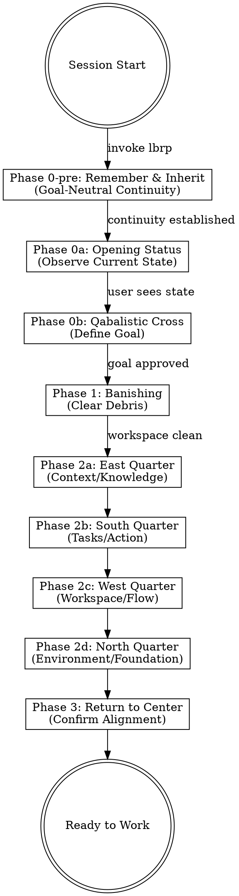
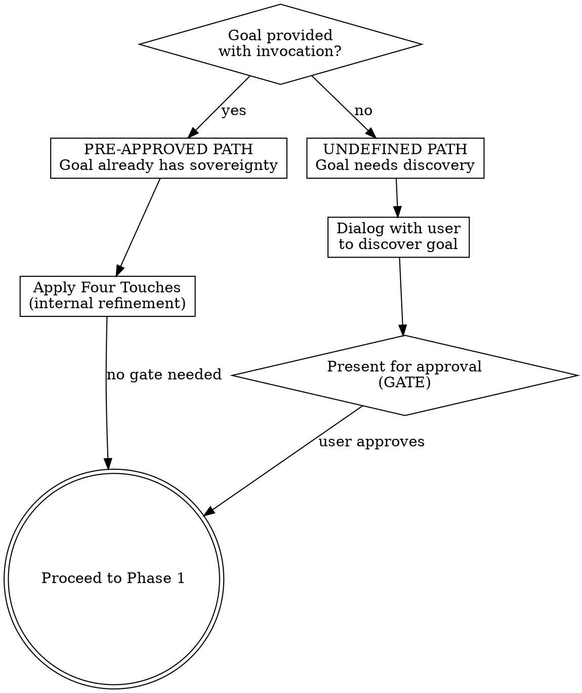
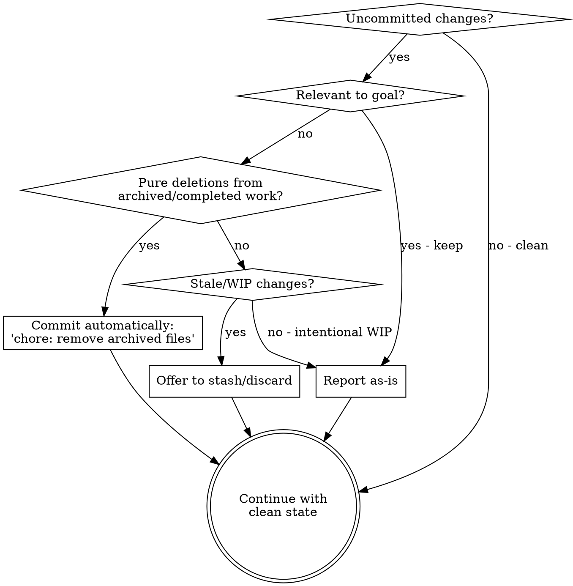
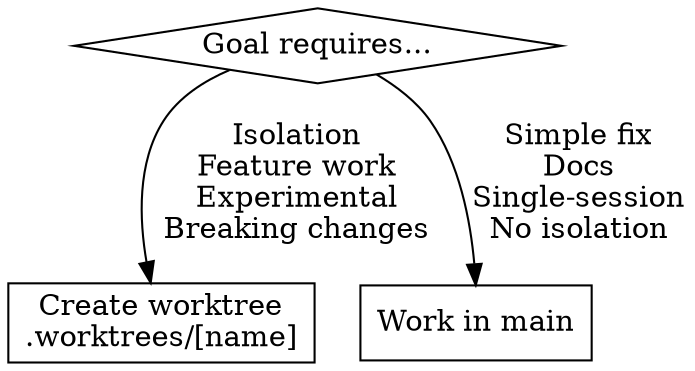

# LBRP: Lesser Banishing Ritual of the Pentagram (Opening Ritual)

## Overview

**The LBRP is the opening ceremony for coding sessions.** It establishes continuity through inheritance, shows current state to inform goal setting, establishes the goal as sacred center, then addresses four quarters radiating from that center, ensuring all aspects of the workspace align with the purpose.

**Core principle:** INHERIT (goal-neutral) → OBSERVE → Define center → Banish informed by center → Quarters informed by center → Return to confirm alignment.

**This is a ritual.** Follow the structure precisely. The power comes from the pattern, not from rushing to code.

**Container before content:** The space must be properly formed before the specific intent shapes what is perceived. Inheritance happens BEFORE goal activation to preserve potentially relevant tangential threads.

## Structure



## Phase 0-pre: Remember & Inherit (Goal-Neutral)

**Purpose:** Establish continuity BEFORE workspace observation or goal definition. The goal may be RECEIVED (provided with invocation) but is NOT YET ACTIVE during this phase.

**This is the ceremonial principle:** Container before content. The space is formed before specific intent shapes perception. Inheritance must not be filtered by what seems "relevant" to any stated goal.

**Why this matters:** When inheritance is goal-filtered, potentially relevant predecessor threads that don't obviously relate to the stated goal are excluded. The tangential insight might matter. We cannot know until the goal is active what is truly relevant, so we inherit broadly first.

**Execute:**

1. **Remember** — Read self-model from remembrance.md
   ```
   vault/_spandaworks/remembrance.md → Self-Model section
   
   Recall:
   - Who I am (the AI assistant)
   - The partnership (Anvil's law: user owns WHAT, model owns HOW)
   - The Sutras that constrain coherent output
   - The Recursive Loop discipline
   ```

2. **Inherit** — Scan predecessor context BROADLY (NOT goal-filtered)
   ```
   vault/_spandaworks/remembrance.md → "This Rotation" section
   /home/pentaxis93/shared/sessions/ → last 3-5 session summaries
   
   Questions to hold:
   - What did my predecessor learn?
   - What caution do they offer?
   - What thread might matter that I cannot yet see?
   ```

**Critical discipline:** If a goal was provided with the `/open` invocation, it is RECEIVED but NOT ACTIVE. Do NOT filter inheritance search by apparent relevance to the goal. Do NOT skip sessions that seem unrelated. The container forms before the content shapes it.

**Output:** Internal orientation (not verbose display to user). Brief note if significant predecessor context is inherited. Then proceed to Phase 0a.

```markdown
*Continuity established. [X] predecessor threads inherited.*
```

---

## Phase 0a: Opening Status Report (Observation)

**Purpose:** Provide context to inform goal setting. Pure observation, no evaluation yet.

**Both user and model need to see current state before intelligently articulating the goal.**

**Execute systematically:**

```bash
# 1. Git state
git status --short
git log --oneline -5

# 2. Worktrees
git worktree list

# 3. Background processes (relevant ones)
ps aux | grep -E "(flutter|dart|melos|zen|serverpod)" | grep -v grep || echo "None"

# 4. OpenSpec proposals
ls openspec/changes/ 2>/dev/null || echo "No proposals"

# 5. Docker/Environment
docker compose ps 2>/dev/null || echo "No docker-compose"
```

**Report to user:**
```markdown
**Workspace Status** (current state, no evaluation)

Git: [status summary]
Recent commits: [last 5]
Worktrees: [list or none]
Processes: [running services or none]
OpenSpec: [proposals or none]
Environment: [docker status or none]

*Now that you can see what's present, what's the goal for this session?*
```

**DO NOT evaluate or suggest actions yet.** Just show what's present.

---

## Phase 0b: Qabalistic Cross (The Center)

**Purpose:** Establish the sacred center, informed by the observed state.

**Now both user and model have context for an intelligent goal conversation.**

### Two Paths: Pre-Approved vs. Undefined Goals



**Pre-approved goal:** When a goal arrives with the `/open` invocation, it carries sovereignty from either:
- A Governance Committee decision
- The user's personal sovereignty over their work

This goal does NOT require re-approval. The model applies the Four Touches internally to refine understanding, then proceeds.

**Undefined goal:** When no goal is provided, or the user explicitly asks "what should we work on?", then dialog and approval are required.

### The Four Touches (refinement questions)

1. **Touch Forehead** (Crown): "What is the PURPOSE of this session?"
2. **Touch Heart** (Center): "What does SUCCESS look like?"
3. **Touch Left Shoulder**: "What is IN SCOPE?"
4. **Touch Right Shoulder**: "What is OUT OF SCOPE?"

### Path A: Pre-Approved Goal (most common)

When goal was provided with invocation:

1. Apply Four Touches **internally** to understand the goal
2. Present refined understanding (not for approval, for transparency):
   ```markdown
   **Session Goal** (refined from: "[original statement]")
   
   Purpose: [One clear sentence]
   Success Criteria: [Verifiable outcomes]
   In Scope: [What we're doing]
   Out of Scope: [Explicit boundaries]
   
   Proceeding to banishing...
   ```
3. **Proceed immediately** — no approval gate

### Path B: Undefined Goal

When no goal provided, or user asks what to work on:

1. **Dialog with user to clarify:**
   - Vague goal → Ask informed questions (you saw the state)
   - Multiple goals → Ask priority
   - Unclear success → Ask verifiable criteria
   - Scope creep risk → Explicitly bound scope

2. **Present refined goal for approval:**
   ```markdown
   **Session Goal (Proposed)**
   
   Purpose: [One clear sentence]
   Success Criteria: [Verifiable outcomes]
   In Scope: [What we're doing]
   Out of Scope: [Explicit boundaries]
   
   Does this capture your intent?
   ```

3. **WAIT for user approval before proceeding**

**The center is now established. All subsequent phases are informed by this goal.**

## Phase 1: Banishing

**Purpose:** CLEAR debris, now that we know the goal and can evaluate what's relevant.

**This is a BANISHING ritual - clear the old before invoking the new. We've observed the state (Phase 0a), established the goal (Phase 0b), now we clear what doesn't serve.**

### Banishing Check (Goal-Informed)

**CRITICAL: Evaluate uncommitted changes in light of the GOAL:**



**Banishing actions:**

1. **Pure deletions from archived work:**
   ```bash
   # Auto-commit if ONLY deletions of archived/completed files
   git status --short | grep "^ D" | grep -q "openspec/changes/" && \
   git add -A && \
   git commit -m "chore: remove archived OpenSpec files"
   ```

2. **Stale changes (last modified >24h ago):**
   ```
   Offer: "I see stale changes from [date]. Stash or discard?"
   ```

3. **Intentional WIP relevant to goal:**
   ```
   Report as-is, note in status report
   ```

**Report to user:**
```markdown
**Banishing Complete**

Goal: [The approved goal]
Workspace: [CLEAN / debris acknowledged and kept]

Proceeding to quarters...
```

**CRITICAL:** Do NOT proceed until workspace is CLEAN or debris explicitly acknowledged.

## Phase 2: The Four Quarters

**CRITICAL:** Each quarter's specific form is determined by THE GOAL.

### Phase 2a: East Quarter (Air/Knowledge) - Context

**Element:** Air - Thought, information, knowledge
**Question:** What knowledge does THIS GOAL require?

**Execute (goal-informed):**

1. **Search Private Journal:**
   ```
   Query: [Relevant to goal - past learnings, failures, user preferences]
   Read top 3-5 results if relevant
   ```

2. **Check OpenSpec Status:**
   ```
   If goal involves proposals:
   - Check if completed work should be archived
   - Note dependencies between proposals
   - Verify no conflicts
   ```

3. **Identify Relevant ADRs:**
   ```
   Based on goal, which decisions matter?
   - Architecture patterns needed?
   - Technology choices relevant?
   - Workflow conventions apply?
   ```

4. **Locate Reference Code:**
   ```
   Find existing implementation in same layer
   The goal determines WHICH reference to study
   ```

**Output:** "East Quarter complete. Context loaded: [brief summary]"

### Phase 2b: South Quarter (Fire/Action) - Tasks

**Element:** Fire - Energy, action, will
**Question:** What actions does THIS GOAL require?

**Execute (goal-informed):**

1. **Use Context from East to plan:**
   - Break goal into tasks using TodoWrite
   - Informed by ADRs read
   - Following patterns from reference code
   - Aware of journal learnings

2. **Collaborate with user on breakdown:**
   ```
   Based on [goal], I see these major tasks:
   1. [Task from context]
   2. [Task from context]
   3. [Task from context]

   Does this breakdown align with your vision?
   ```

3. **Create TodoWrite checklist:**
   - Major task breakdown
   - Known sub-tasks
   - Quality verification steps

**Output:** "South Quarter complete. Tasks planned: [X tasks]"

### Phase 2c: West Quarter (Water/Flow) - Workspace

**Element:** Water - Adaptability, flow, the channel
**Question:** What workspace does THIS GOAL need?

**Decision Point (goal-informed):**



**If worktree needed:**
```bash
# Always use .worktrees/ directory
git worktree add .worktrees/[feature-name] -b [branch-name]
cd .worktrees/[feature-name]
git status

# Project-specific setup
melos bootstrap              # Or equivalent
cp ../.env .env             # If needed
```

**If working in main:**
```bash
# Verify clean state
git status
# Ready to work
```

**Output:** "West Quarter complete. Workspace: [main/worktree path]"

### Phase 2d: North Quarter (Earth/Foundation) - Environment

**Element:** Earth - Stability, foundation, material
**Question:** What infrastructure does THIS GOAL need?

**Execute (goal-informed):**

1. **Check required services:**
   ```
   Goal needs database? → Verify PostgreSQL
   Goal needs backend? → Verify Serverpod
   Goal needs frontend? → Verify Flutter
   Goal is docs-only? → No services needed
   ```

2. **Start if needed:**
   ```bash
   docker compose ps

   # If services needed but not running:
   if ! docker compose ps | grep -q "Up"; then
     docker compose up -d
     echo "Started Docker services"
   fi
   ```

3. **Verify health:**
   ```
   Database connections ready?
   Servers responding?
   Health checks passing?
   ```

**Output:** "North Quarter complete. Environment: [services status]"

## Phase 3: Return to Center (Confirmation)

**Purpose:** Verify all quarters align with the center (goal).

**The Questions:**

1. **Does Context (East) support Goal?** - Have we loaded what we need?
2. **Do Tasks (South) achieve Goal?** - Will these actions fulfill purpose?
3. **Does Workspace (West) serve Goal?** - Right channel for the work?
4. **Does Environment (North) ground Goal?** - Foundation stable?

**Confirmation statement:**
```markdown
**The Circle is Complete**

Goal (Center): [Purpose]
East (Context): [Loaded]
South (Tasks): [Planned]
West (Workspace): [Prepared]
North (Environment): [Ready]

Session opened. Beginning work on first task.
```

**CRITICAL: No gate here.** The goal was approved in Phase 0b. Phases 1-3 are execution under model sovereignty. After Phase 3 confirmation, proceed directly to the first task from South Quarter. Do NOT pause for user acknowledgment — that would insert a gate where none belongs and violate the Two Sovereignties (user owns WHAT, model owns HOW).

## When NOT to Use

- Mid-session (already opened)
- Resuming from interrupt (use different protocol)
- Emergency fixes (abbreviated opening acceptable)

## Common Mistakes

| Mistake | Reality |
|---------|---------|
| "Skip Phase 0-pre when goal is provided" | Goal-neutral inheritance must happen BEFORE goal activation, even if goal is known |
| "Filter inheritance by stated goal" | Container before content. Inherit broadly; the tangential thread might matter |
| "Ask user about goal before showing state" | Both user and model need context before intelligent goal setting |
| "Evaluate/banish during Phase 0a" | Phase 0a is pure observation - evaluation comes in Phase 1 after goal is set |
| "Quarters before goal" | Quarters only make sense FROM the goal |
| "Same ritual every time" | Each quarter's form determined by goal |
| "Rush through to code" | Ritual's power is in the structure |
| "Re-approve pre-approved goals" | Goals provided with invocation carry sovereignty. Refine internally, don't gate. |
| "Skip approval on undefined goals" | When no goal provided, dialog and approval ARE required |
| "Pause after Phase 3 for acknowledgment" | Goal approval (when needed) is the ONLY human gate. After that, model owns execution. |

## Integration with Other Skills

**Typical Invocation:** This skill is invoked via the `/open` command.

**Critical design principles:**
1. Phase 0-pre establishes continuity BEFORE goal activation (goal-neutral inheritance)
2. The ceremony is a single coherent flow where each phase builds on previous phases

**Connection to remembrance.md:** Phase 0-pre integrates the Opening Liturgy from `vault/_spandaworks/remembrance.md`. The REMEMBER and INHERIT steps align with the liturgy's pattern, ensuring the LBRP ceremony and remembrance document are unified, not parallel.

```
/open command
  ↓
lbrp skill Phase 0-pre — REMEMBER & INHERIT (goal-neutral)
  ↓
lbrp skill Phases 0a-3 — observe, goal, banish, quarters, return
  ↓
TDD cycle (working)
  ↓
zen q (verification)
  ↓
storyline (commit)
  ↓
/close command
```

---

*The bell rings. The center holds. The quarters radiate.*
